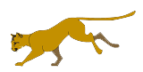
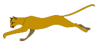
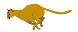

# Adding Hazards to Your Platform Game

So....you made a character that can jump around. That's great and all, but every story needs some conflict and every Hero needs a villain. In this lesson, we will learn how to create multiple **hazards** that cause harm to the Hero. We will create a pit that the Hero can fall into and a moving attacker. To display the player's status, we will create a variable to track the number of lives remaining and a meter to display the Hero's health.

## A Note on Abstraction

There are many different kinds of hazards: Koopa Troopas, lava pits, falling rocks, spikes, knives, bullets, fire breathing dragons, and any other enemy you can imagine. Even though all of these hazards are different, they share certain characteristics. It is important to combine common characteristics into blocks to make our code simpler and reduce duplication. 

We learned about the concept of **abstraction** when discussing custom command blocks and reporters. Custom blocks allow you to combine multiple commands into a single named block of code. If you write your entire game in a straight line, it will get very long and complicated. If you find that making a simple change to your game logic involves changing the same value in many places, chances are you can **refactor** your code to reduce duplication. If it is hard to find a particular piece of logic when asked, chances are your program can be simplified to make it easier to read. Think about reading a book that has no chapters, paragraphs, or indentation: It would just be a big wall of text. A good program should be divided into named sections that make it easy to read and debug.

Let's consider a game with 10 different hazards and 10 different powerups. Many of them probably share some common characteristics. For instance, a health powerup and an enemy attack both change the Hero's health. So we may want to create a custom block for managing the Hero's health. We may also want a custom block for changing the number of lives a player has remaining. Falling into a lava pit and touching a "1-up" both change the number of lives a player has remaining, even if they change it in opposite ways. 

### Falling into a Pit

A common stationary hazard is a pit that the Hero must jump over. Failing to clear the pit results in the loss of life. Easy enough. We need to keep track of the following:

* __Lives__ - the number of lives will be a variable that stores a number. At the beginning of the game, we can initialize this variable with the number of starting lives in our game. For now, let's choose 3.
* __Visual representaton of the pit__ - this will just be a hole in the ground. Simply erase a chunk of the ground so that gravity will make the player fall off the screen under certain conditions. If the player's X and Y positions are within the boundaries of the pit, the player won't reach the ground on the other side. 

![Pit]

* __A custom block to change the number of lives remaining__ - When the player dies, we will want to subtract one from the number of lives. Why do we want this in a custom block? Well, there maybe more than one hazard that takes away the player's life, or there may be a powerup that gives the player another life. We also might want to add a sprite that changes costumes when the player loses a life or execute other code when the number of lives change. Therefore, it is good to combine all of this code into a single block. 
* Check boundaries block that subtracts lives when off stage. This boundary check must happen at the right place, can have just a block for falling. Off stage -> subtract a life. Will keep subtracting lives unless you have a way to start the level again at beginning. Good to have a custom block for starting the level again with one less life.

Will want to keep track of the player's lives. At the beginning of the game, lets create a variable to store the number of lives. Each time the player dies, we can broadcast a message to subtract a life. One variable that keeps track of a player's health, let's say the player has a health bar with 3 hearts. Lose all hearts, you lose a life. 

Lives Sprite -> Change costume when receive player died message
Health Sprite -> Change costume when receive player lost health message. How much health? Custom block. Different things make the player lose different amounts of health, so input can vary. Healthbar 100 in increments.
Health sprite should also check if health <= 0, then can broadcast death/change life.

### Running into an Moving Enemy

They say that every hero needs a villain. Let's add an Enemy sprite to our game that will cause damage to our hero. 

#### Creating an Enemy Sprite

Create a new Sprite in Snap and name it "Enemy". The Enemy sprite should have one or more costumes. For this example, the enemy will be a large cat. Right click and save the following set of images to a folder, then drag them to the costumes tab in Snap. Add a short script with a forever loop that changes costumes every 0.1 seconds to make the Enemy sprite appear in motion. Add a block to set the Enemy sprite's starting X-Y position. Add a block to make the Enemy move towards the Hero as it changes costumes. See the script below.
 

* __Enemy Attacks__ - When the Enemy touches the Hero, the hero should change costumes to show the attack visually. Maybe the attack injures the Hero permanently. 
* __Adding a Health Meter__ - When the Enemy touches the Hero, the hero should lose health. This should be indicated by a Health sprite. Multiple costumes for each health status.
